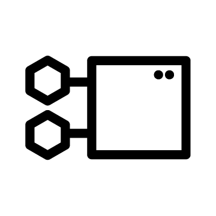
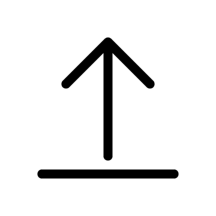
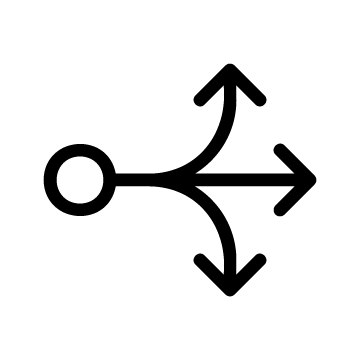

---
# Feel free to add content and custom Front Matter to this file.
# To modify the layout, see https://jekyllrb.com/docs/themes/#overriding-theme-defaults

layout: default
menu: false
---
# Horreum
<h3 id="project_description">{{ site.description }}</h3>

<h4>Installation</h4>

    <a class="task" href="docs/operator.html">
        

            
        

        Deploy on Openshift
    </a>
    <a class="task" href="docs/docker_compose.html">
        

            
        

        Deploy using docker-compose
    </a>
    <a class="task" href="docs/baremetal.html">
        

            
        

        Install on bare-metal machine
    </a>

<h4>The basics</h4>

    <a class="task" href="docs/test_run_schema.html">
        

            
        

        Tests, Runs and Schemas
    </a>
    <a class="task" href="docs/user_management.html">
        

            
        

        User management
    </a>

<h4>Guides</h4>

    <a class="task" href="docs/create_test.html">
        

            
        

        Create a new Test
    </a>
    <a class="task" href="docs/upload.html">
        

            
        

        Upload data
    </a>
    <a class="task" href="docs/customize_views.html">
        

            
        

        Customize views
    </a>
    <a class="task" href="docs/regression.html">
        

            
        

        Regression variables
    </a>
    <a class="task" href="docs/webhooks.html">
        

            
        

        Define webhooks
    </a>
    <!-- TODO
    <a class="task" href="docs/backup.html">
        

            
        

        Backup your data
    </a>
    -->

Horreum is licensed under <a href="http://www.apache.org/licenses/LICENSE-2.0">Apache License 2.0</a>. 
 
You can reach us on <a href="https://hyperfoil.zulipchat.com/">Zulip</a>

