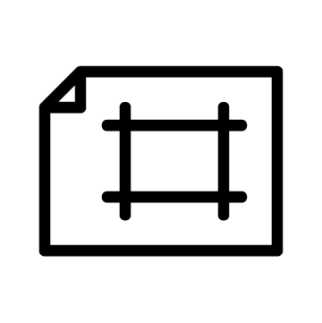
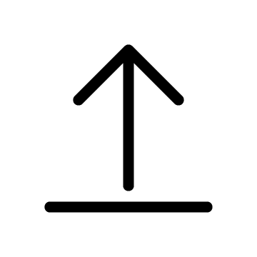
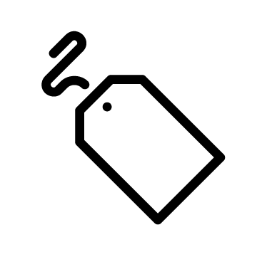
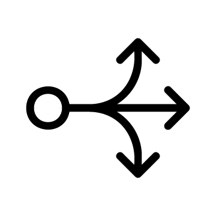
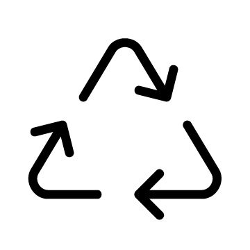

---
# Feel free to add content and custom Front Matter to this file.
# To modify the layout, see https://jekyllrb.com/docs/themes/#overriding-theme-defaults

layout: default
menu: false
---

# Horreum

<h3 id="project_description">{{ site.description }}</h3>

<h4>Tutorials</h4>

    <a class="task" href="docs/tutorial/start.html">
        

            
        

        Start Horreum on local machine
    </a>
    <a class="task" href="docs/tutorial/create_test_run.html">
        

            
        

        Create a test and upload Run
    </a>

<h4>How to...</h4>

    <a class="task" href="docs/howto/operator.html">
        

            
        

        ...deploy Horreum on Kubernetes/Openshift
    </a>
    <a class="task" href="docs/howto/production.html">
        

            
        

        ...setup Horreum in production
    </a>
    <a class="task" href="docs/howto/add_users.html">
        

            
        

        ...add users and set roles
    </a>
    <a class="task" href="docs/howto/create_test.html">
        

            
        

        ...create a new Test
    </a>
    <a class="task" href="docs/howto/upload.html">
        

            
        

        ...upload Runs
    </a>
    <a class="task" href="docs/howto/define_schema.html">
        

            
        

        ...define Schema and View
    </a>
    <a class="task" href="docs/howto/datasets.html">
        

            
        

        ...transform Run to Dataset
    </a>
    <a class="task" href="docs/howto/change_detection.html">
        

            
        

        ...setup Change Detection
    </a>
    <a class="task" href="docs/howto/actions.html">
        

            
        

        ...setup Actions
    </a>
    <a class="task" href="docs/howto/retransform_datasets.html">
        

            
        

        ...re-transform Datasets
    </a>

<h4>Discussion</h4>

    <a class="task" href="docs/about/concepts.html">
        

            
        

        Tests, Runs, Datasets and Schemas
    </a>
    <a class="task" href="docs/about/users.html">
        

            
        

        About users and roles
    </a>

<h4>Reference</h4>

    <a class="task" href="docs/reference/openapi.html">
        

            
        

        OpenAPI v3.0 definition
    </a>

Horreum is licensed under <a href="http://www.apache.org/licenses/LICENSE-2.0">Apache License 2.0</a>. 
 
You can reach us on <a href="https://hyperfoil.zulipchat.com/">Zulip</a>

